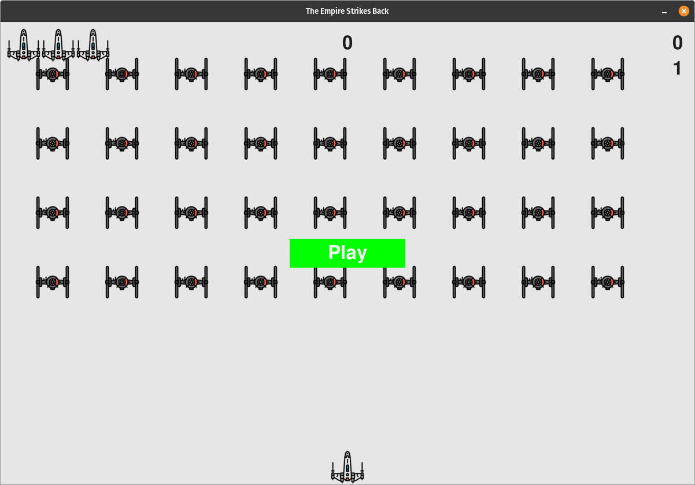
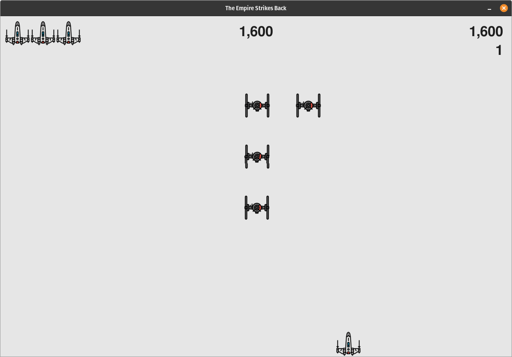
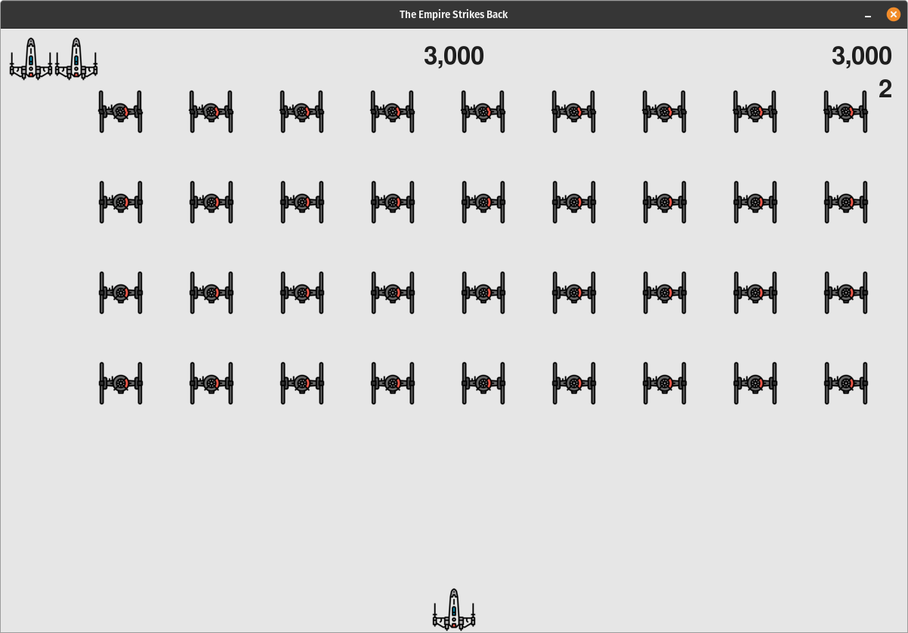
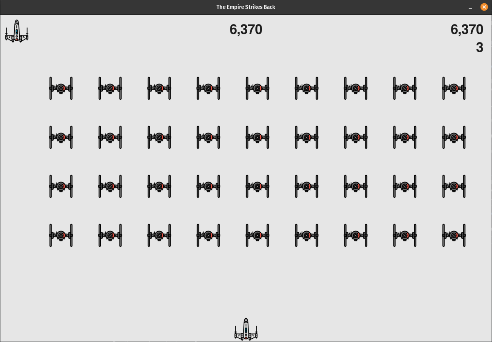

<p align="center">
  <a href="" rel="noopener">
 </a>
</p>

<h3 align="center">The Empire Strikes Back</h3>

<div align="center">

  [](/LICENSE)

</div>


<p align="center"> A 2D game in which the aim is to shoot down a fleet of Tie Fighters
    <br> 
</p>

## 📝 Table of Contents
- [About](#about)
- [Getting Started](#getting_started)
- [Usage](#usage)
- [Preview](#preview)
- [Built Using](#built_using)
- [Authors](#authors)

## 🧐 About <a name = "about"></a>
In The Empire Strikes Back project, I used the Pygame package to develop a 2D game in which the aim is to shoot down a fleet of Tie Fighters as they drop down the screen in levels that increase in speed and difficulty. 

The TIE starfighter, simply known as the TIE Fighter or T/F, was the standard Imperial starfighter seen in massive numbers throughout most of the Galactic Civil War and onward.

## 🏁 Getting Started <a name = "getting_started"></a>
These instructions will get you a copy of the project up and running on your local machine for development and testing purposes. See [deployment](#deployment) for notes on how to deploy the project on a live system.

### Prerequisites
The following are the necessary tools needed to run/extend the current project:

* [Python 3+](https://www.python.org/downloads/) - python interpreter

### Installing

To get the development environment ready to extend the current project, just type the following command in a terminal window opened in the root directory of this project:
 - Linux/MacOs:
   ```bash
   ./setup.sh
   ```
 - Windows:
   ```bash
   ./setup.bat
   ```

## 🎈 Usage <a name="usage"></a>
To run the game and test your skills first activate the ```test-env``` virtual environment: 
 - Linux/MacOs: 
   ```bash
   source test-env/bin/activate
   ```
 - Windows: 
   ```bash
   .\test-env\Scripts\activate
   ```
After activating the environment type:
  - Linux/MacOs:
    ```bash
    python3 start.py
    ```
  - Windows:
    ```bash
    py start.py
    ```
## 👀 Preview <a name = "preview"></a>
</a>
</a>
</a>
</a>

## ⛏️ Built Using <a name = "built_using"></a>
- [Pygame](https://www.pygame.org/news) - library suited for game development in Python
- [Visual Studio Code](https://code.visualstudio.com/) - code editor


## ✍️ Authors <a name = "authors"></a>
- [@gabriel-rusu](https://github.com/gabriel-rusu) - Idea & Initial work
